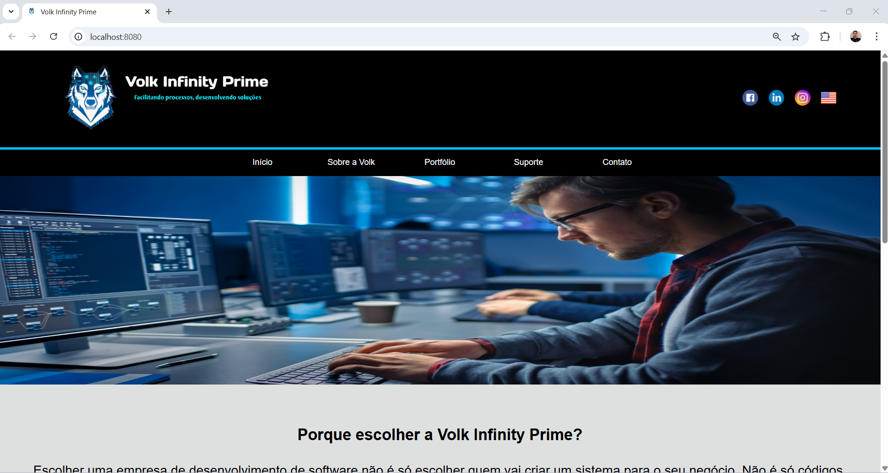

# 🐺 Volk Infinity Prime

Este projeto foi desenvolvido durante o meu período de formação técnica na ETEC Basilides de Godoy. Ele representa a consolidação de conhecimentos em desenvolvimento web, onde apliquei conceitos fundamentais de estruturação, estilização e responsividade para criar uma solução institucional.

O site foi recentemente refinado e atualizado, demonstrando a evolução das minhas habilidades desde o projeto acadêmico inicial.

## 🚀 Funcionalidades
- **Seção de Contato:** Formulário e Google Maps.
- **Internacionalização:** Suporte para versões em Português e Inglês.
- **Redes Sociais:** Links rápidos no cabeçalho e rodapé.

## 🛠️ Tecnologias Utilizadas
- **HTML5:** Estruturação semântica do conteúdo.
- **CSS3:** Estilização, utilizando **Flexbox** para alinhamentos e **Media Queries** para responsividade.
- **GitHub:** Controle de versão.

## 🔧 Como rodar o projeto localmente
1. **Clone o repositório:**
   ```bash
   git clone [URL_DO_SEU_REPOSITORIO_AQUI]
   ```

2. **Abra a pasta do projeto.**

3. **Execute o arquivo index.html em seu navegador de preferência.**

## 📸 Demonstração do Layout
